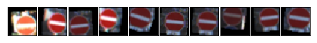
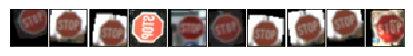
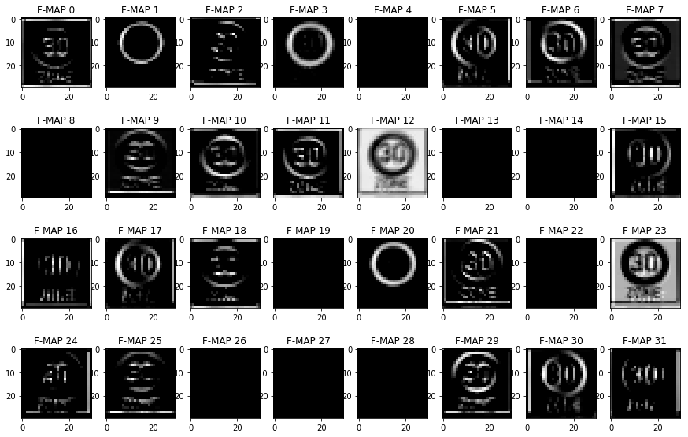

#**Traffic Sign Recognition** 

[TOC]

##Introduction
For a self driving car to run on road the algorithms should be able to understand the traffic signs, rules just as a human being. Based on this, actions like stop, reduce speed, increase speed etc can then be defined for the car to operate.

The document describes various steps and models that were used to identify and classify german traffic signs. For classification machine learning algorithms were used along with basic image processing. 

The document first describes the goal of the project, the process that was taken to pre-process training set, models and debugging that was done to be able to increase the accuracy for the predictions. The model once trained was run over the test set and traffic sign images that were downloaded from the web.

----

##Project Goals
The goals  of this project are the following:
* Build and train a neural network to be able to classify the german traffic signs with at-least 0.93 accuracy.
* Use the model to classify test set and random traffic sign images downloaded from the web.
* Reflect on the choice of model, pre-processing techniques used for images, models, performance on the captured images.

---

##Reflection

Training data for the project was downloaded from [here](https://d17h27t6h515a5.cloudfront.net/topher/2017/February/5898cd6f_traffic-signs-data/traffic-signs-data.zip).
This is a zip file that contained the following:
 1. Training data in pickle form.
 2. Validation data in pickle form.
 3. Test data in pickle form.
 4. CSV of traffic sign name and corresponding identifiers.


###UNDERSTANDING THE DATA
The pickle object contained 4 key/ value pair:
 *features* : raw pixels (num_examples, 32 (width), 32 (height), 3 (channels))
 *labels* : sign identifiers corresponding to the features.
 *sizes*  : list of tuple containing original width and height of the image
 *coords* : containing tuples, (x1, y1, x2, y2) representing coordinates of a bounding box around the sign in the image.

| Set             |    Number of data |
| :--------       | -----------------:|
| Training set    |    34799          |
| Validation set  |     4410          |
| Test set        |    12630          |
 
 > **The images were of the shape 32 x 32 x 3 and there were 43 classes of german traffic signs.**
| Class ID            |    SignName   |                                        
| :-------------------- | :-----------|
| 0 |  Speed limit (20km/h)  |
| 1 |  Speed limit (30km/h)  |
| 2 |  Speed limit (50km/h)  |
| 3 | Speed limit (60km/h) |
| 4 |  Speed limit (70km/h) | 
| 5| Speed limit (80km/h) | 
| 6| End of speed limit (80km/h)| 
| 7| Speed limit (100km/h)| 
| 8| Speed limit (120km/h)| 
| 9| No passing| 
| 10| No passing for vehicles over 3.5 metric tons| 
| 11| Right-of-way at the next intersection| 
| 12| Priority road| 
| 13| Yield| 
| 14| Stop| 
| 15| No vehicles| 
| 16| Vehicles over 3.5 metric tons prohibited| 
| 17| No entry| 
| 18| General caution| 
| 19| Dangerous curve to the left| 
| 20| Dangerous curve to the right| 
| 21| Double curve| 
| 22| Bumpy road| 
| 23| Slippery road| 
| 24| Road narrows on the right| 
| 25| Road work| 
| 26| Traffic signals| 
| 27| Pedestrians| 
| 28| Children crossing| 
| 29| Bicycles crossing| 
| 30| Beware of ice/snow| 
| 31| Wild animals crossing| 
| 32| End of all speed and passing limits| 
| 33| Turn right ahead| 
| 34| Turn left ahead| 
| 35| Ahead only| 
| 36| Go straight or right| 
| 37| Go straight or left| 
| 38| Keep right| 
| 39| Keep left| 
| 40| Roundabout mandatory| 
| 41| End of no passing| 
| 42| End of no passing by vehicles over 3.5 metric tons| 

The following shows the distribution of features per data set:


In all the distribution above we can see that the data was very skewed and had less features for certain classes. This led to my model not being able to predict most of the traffic signs. I also encountered very less accuracy while working on the traffic sing images that were downloaded  from the web.

###PRE-PROCESS DATA
The training set was extended by adding images generated post rotation, shifting, flipping and zooming. Here I had explored *keras library* for generating training data, but just to understand the above image processing technique implemented it using PIL and numpy. I was interested in exploring ZCA whitening after reading it as one of the best practices, but it was taking a long time zca to be applied.

Sample of generated images:




With the above method a total of **16125** images were randomly generated for all of the traffic signs and added to the training set. The distribution now looked 


Post this I tried converting the image to YUV and later to grayscale but did not see any improvement in the accuracy and it was just adding to the processing time.

The Training set, validation and test set was then normalized using the following:
```
(dataset - 128.0) / (128.0)
```
Post this I could see improvement with model accuracy.


###NEURAL NETWORK MODEL
The ConvNet architecture is composed of 3 repeated layers and then followed by 3 fully connected layers.  Each convolution layer contains a convolution module, followed by a rectified module. Max pooling module is used between convolution layer 1 and convolution layer 2.  

All convolution layer are of kernel 3 x 3. Layer 1 of convolution produces a depth of 32, the second layer produces the depth of 64 and finally the third layer produces the depth of 128. All max pooling layer are of stride 2 x 2.

The output of convolution layer 3 is then flatten to passed to the first fully connected layer with node 2048. This is then connected to the next fully connected layer of node 512. The next fully connected layer also consists of 512 nodes which is then passed onto generate logits of 43 nodes.

Training of the network with dropouts applied at convolution layers and fully connected are 0.6 and 0.5 respectively.  Adam Optimizer is used for stochastic optimization with an exponential learning rate decay at each epoch. The starting learning rate is set to .003 which would decay by .99 after each epoch. 

256 inputs was used as batch size and it took around 100 epochs to train the network with more than .93 accuracy.


The model got evolved from LeNet architecture and had to be go through an iteration were the following techniques were used:
- DROPOUT : Initially the model didn't have any dropout and this resulted in more generalization. It was fitting well on the training set and poorly on the validation and test sets. Thus it was overfitting. Playing with a single dropout the model started to show better accuracy at validation set and was not doing well with the training set itself. Figured out that using two different dropout values for convolution layer and fully connected layer performed better.
- CONVOLUTION DEPTH : Started with smaller depth of 8 at layer 1 and then moved onto 16. In both these cases the accuracy was low. Looking the the visualization for layer 1, figured out the feature map learnt was very low starting from the beginning itself. So increased it to 32 and correspondingly doubled at layer 2 and layer 3.
- NUMBER OF NODES AT FULLY CONNECTED : With the number of nodes increasing at convolution layer the nodes also increased at fully connected layer. I would see better results when the node would increased.
- NUMBER OF LAYERS : Increased the number of layer from starting LeNet architecture with 1 each for convolution and fully connected. I saw good performance once this was done.
- LEARNING RATE : I started with static .001 learning rate and model would take around 100 - 150 epoch to learn. Also as the epoch increased so did the cost at validation set once pass a threshold. Figured out that it's a good idea to decay the learning rate. Eventually settled down to .003 with decay of .99 at each epoch.
- EPOCHS : I would see that after certain epochs the cost would start increasing which would be due to overfitting of the model. Played with different values like 80, 100 and 150. Finally 100 worked.

###PERFORMANCE

| Set             |    Accuracy |
| :--------       | -----------------:|
| Training set    |    0.9078         |
| Validation set  |    0.9313         |
| Test set        |    0.928          |


*Note: Blue is validation and green is training* 


*Note: Blue is validation and green is training* 

Along the above 8 images were downloaded from the web to test the accuracy of the model. With progress in the performance of the model the accuracy also went up until 100 % accuracy was reached.

----


----

 
 
*Note : Images are stored in ./images/ . Name of the images is the class ID*

###SOFTMAX PROPABILITIES

Softmax probability of the images is as shown:

| Probability         	|     Prediction	        					| 
|:---------------------:|:-----------------------------------:| 
| 1.0         			| Stop sign  |  
| .62     				| Speed Limit 30 (km/h) 	|
| 1.0 					| Yield		|
| 1.0 	      			| Road Work	|
| .36				    | Children Crossing  |
| 1.0 				    | No entry  |  
| 1.0 				    | Keep Right |   
| 1.0				    | Roundabout mandatory  |  


STOP 

SPEED LIMIT 30 KM/H 

ROAD WORK

CHILDREN CROSSING

ROUNDABOUT MANDATORY 

NO ENTRY

KEEP RIGHT

YIELD


###VISUALIZATION


Visualizing across different experiments gave me an insight as to what features layer 1 of convolution is learning. I could not understand or visualize layer 2 and 3 of convolution network.

Based on the output for 8 and 16 depth layer1, It seemed that most of the features was missing and is included some dead feature maps. It did not seem that the layer was learning about colors so though of converting the images to gray. As this did not improve the accuracy I kept RGB.

On increasing the layer 1 feature depth to 32, a lot more details were learnt as shown in the image above. Once I had made this change and correspondingly changes the subsequent layers by doubling the depth.

Also reduced the kernel from 5 x 5 to 3 x 3 which improved the accuracy of the model.